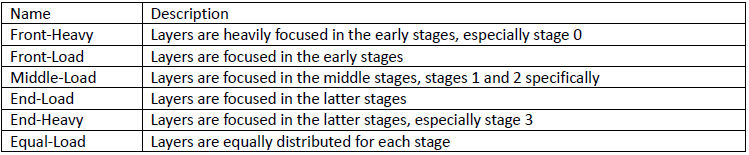
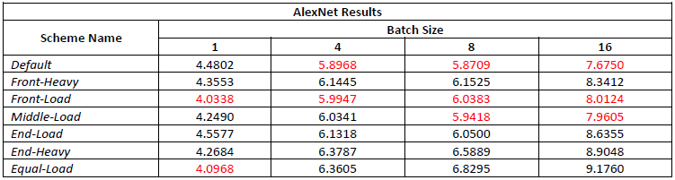
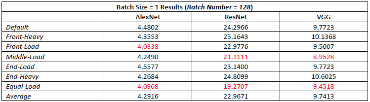
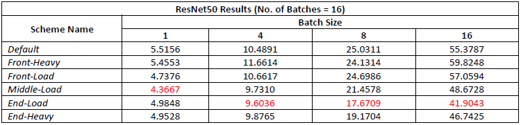
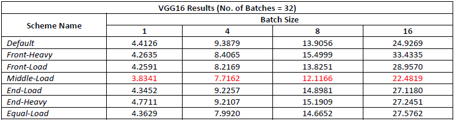

# nn_pipeline
 Pipelining of three neural network models: Alexnet, ResNet50, and VGG16.

## Specification
Given a four-layer Convolutional Neural Network (CNN) model, the code is partitioned into four stages. 

1. The code sponsors four processes with each assigned one partition of the CNN model and one CPU core. 
2. The code assigns the first process as the master process. 
3. The code executes each partition of the CNN model sequentially: each part of the CNN model is trained on one CPU core.

## Performance Evaluation

I have implemented the pipelined DNN models, which adopts PipeDream’s inter-batch parallelism, but to optimize 
the execution of the DNN models, number of layers of each stage was modified based on the schemes below. 

6 layer distribution schemes are introduced, where each scheme is characterized by the concentration of layers for each stage. 
There are five schemes: Front-Heavy, Front-Load, Middle-Load, End-Load, End-Heavy, and Equal-Load scheme. 
Before optimizing the partitions to achieve the highest throughput, I have decided to observe the performance for each scheme. 
Below is the name and characteristics of each scheme.

To further investigate the ideal partition of the stages, I have run the three DNNs based on the schemes above and the results are as follows. For each batch and schemes, the script was run 5 times and took the average of the results.

The result for AlexNet indicates that Front-Load scheme yielded the shortest execution time for most of the batch sizes. It was interesting to find that Default scheme, which was originally provided in the template and which is similar to End-Load scheme, yielded the fastest results for larger batch sizes. The main observation is that for smaller batch sizes, Front-Load scheme is the fastest as Front-Load consistently outperformed Default scheme. Since batch size of 1 was to simulate a GPU case, I believe the batch size 1 case is easier to be generalized, and thus a more reliable measure.

Before discussing about the performance variance when the batch size was modified for ResNet50 and VGG16, the above chart shows the performance difference between the DNNs. Most notably, all the methods show impressive results when layers were distributed relatively evenly among the stages. However, the best performance for VGG comes when the layers were concentrated in stage 1 and 2.

For ResNet50, the models were run on 16 batches of varied size. The number of batches were reduced due to the memory issue, but the test results were coherent, nonetheless. The result indicates that equally loading the layers yield the highest performance. However, due to pipeline hazards, the layers were not perfectly distributed equally. The Equal-Load layer distribution was biased towards the latter stages, but the initial configuration yielded the best performance.

For VGG16, the best performance came from Middle-Load scheme where layers were concentrated in Stage 1 and Stage 2. As a result, the ideal partition that I have selected came from modifying the Middle-Load scheme. This result has clearly indicated that the number of layers does not correlate exactly with the load of each stage. And thus, the underlying computational intensity should be considered when partitioning the stages.

**Result Evaluations and DNN Optimization Analysis**

Based on the observation above, the factors affecting the training throughput are, layer distribution, computational intensity of each layers, and memory utilization. The above modifications to the loads among the stages clearly identifies the importance of layer distribution, but only with an understanding of the underlying models and the layers. The fact that ideal, or fastest, partition is different for each of the NN models indicates that the optimizer for load-balancing needs to be aware of the underlying models. Manual testing of most combinations of layers could be time consuming, and thus like the PipeDream’s load optimizer, being model-aware of the underlying NN is crucial.

In addition, increasing the batch size significantly affects the execution time of the models. I believe that this is in part due to the memory acting as a bottleneck. For the case of training higher number larger batches through ResNet and VGG, the memory utilization rate was almost 100%, and the basic template code for ResNet could not fully execute for high number of batches on my local machine. As a result, efficient transfer of the input & output results and sufficient memory space for the model is crucial for batch with a greater size.
